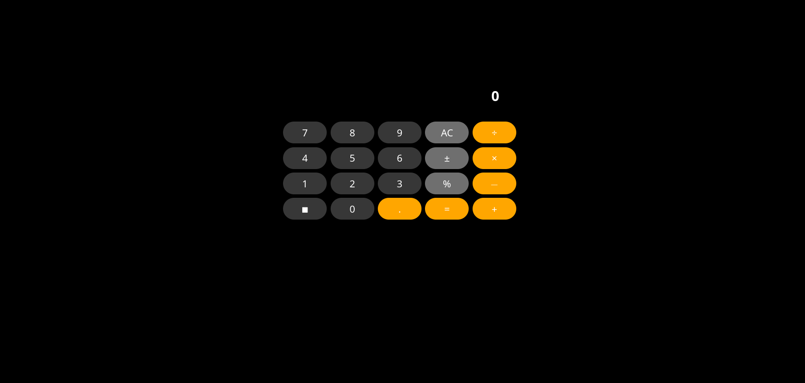

# 🧮 Calculator

A simple, functional calculator built with HTML, CSS, and JavaScript. This project performs basic arithmetic operations such as addition, subtraction, multiplication, and division.

## 🚀 Features

- Clean and intuitive user interface
- Basic arithmetic operations
- Clear and delete functions

## 📸 Screenshot

## 🛠️ Technologies Used

- HTML5
- CSS3
- JavaScript (ES6)

## 🔮 Future Features

- Keyboard Support
- History Log
- Advance Operations
- Order of Operations

## 🙌 Acknowledgements

This project is in the curriculum of [The Odin Project](https://www.theodinproject.com), an open-source curriculum for learning web development.
